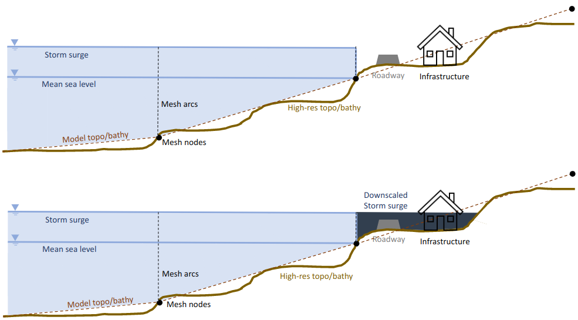
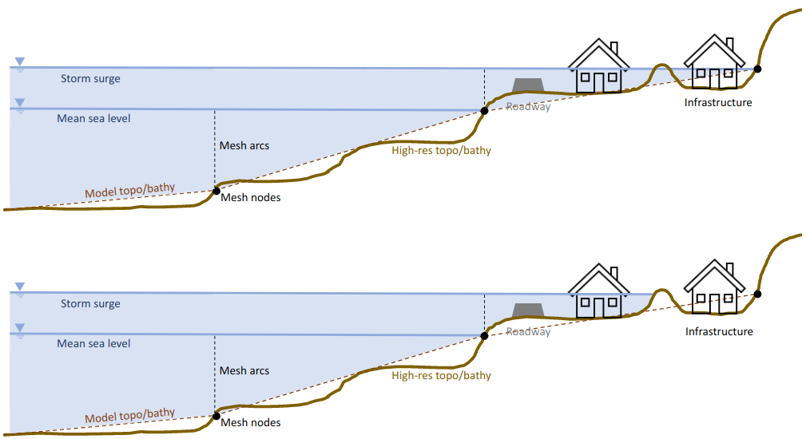

Kalpana is a Python module to convert *ADCIRC* output files to geospatial vector formats (shapefile or kmz) and to downscale the maximum water elevation *maxele.6.nc*. 

## *ADCIRC* to geospatial vector files

Kalpana is capable of converting time-varying outputs such as the significant wave height and time-constant outputs such as the maximum water elevation into polylines or polygons in both of the recently mentioned formats.
Kalpana was originally built by Rosemary Cyriac, and her efforts were aided by the initial attempts of Rich Signell (USGS) and Rusty Holleman to generate shapefiles from ADCIRC results. Then, Jason Fleming improved Kalpana and incorporated the code into ADCIRC Surge Guidance System (ASGS) that he maintains at the Renaissance Computing Institute (RENCI).

## Downscaling

Kalpana transforms the *ADICRC* *maxele.63.nc* file to a constant and higher resolution DEM considering small scale topographic/bathymetric features. The static downscaled method was developed by Nelson Tull, and the incorporated into Kalpana along with a new downscaling method by Carter Rucker. The details can be found in [this paper](https://link.springer.com/epdf/10.1007/s11069-021-04634-8?sharing_token=5GBxenc0qDVGHm3BGk6KhPe4RwlQNchNByi7wbcMAY69maaLpgXTBxca-OorPGWBn2w2ySSkXhIRhNeWoyNx8-ituX0UqAcNj_LDMh_kFz6sCpb5e882TbeHKiKpzRd_j4XfVH_6ONriheKYxx2CECQI07z23OD-pFrCALWfyVc=). The schematics below show the downscaling process.

**Storm surge expansion**

**Storm surge contraction**

## Updated version

Kalpana was updated to python 3 and upgraded by Tomás Cuevas as a part of his MSc research.
Instructions for using Kalpana can be found in the examples folder.
For any question, comment or suggestion please send an email to tomascuevas@gmail.com or open an *Issue*
